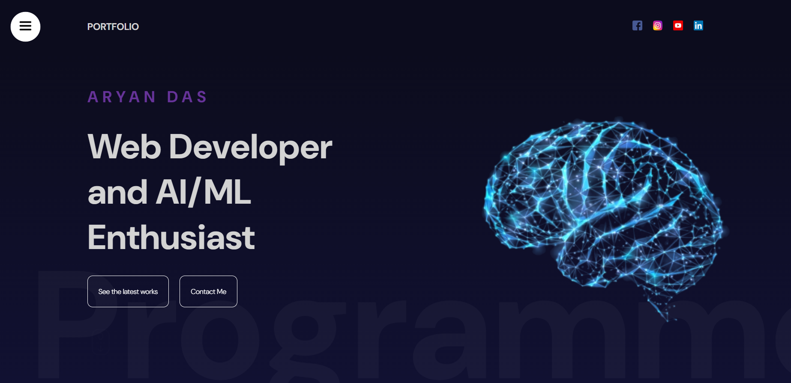
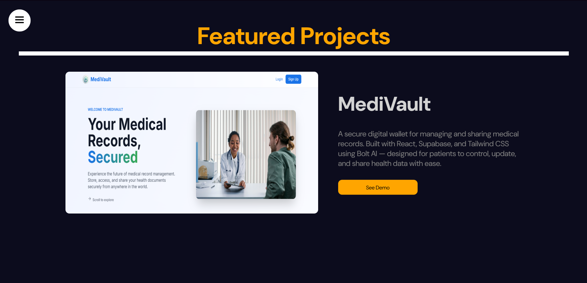

# 🧠 Personal Portfolio — React + Framer Motion

A modern, interactive developer portfolio built with **React** and **Framer Motion**, featuring scroll-based animations, a sticky progress bar, and a clean, responsive layout. This project showcases my key development projects in a visually engaging way, with smooth animations and a modular code structure.

## ✨ Features

- ⚡ Scroll-based parallax animations using `framer-motion`
- 🧠 Project cards with dynamic image/text transitions
- 📊 Sticky scroll progress indicator
- 💅 Fully responsive layout (CSS/SASS-based)
- 💼 Optimized for showcasing multiple projects
- 📁 Easily extensible for new projects or sections

## 🛠️ Tech Stack

- **React** (Functional Components, Hooks)
- **Framer Motion** (`useScroll`, `useTransform`, `motion.div`)
- **SASS / SCSS** for modular styling
- **Vite / CRA** *(depending on your setup)*
- **Responsive Design Principles**

## 📸 Demo Preview

     


## 📂 Folder Structure
src/
│
├── components/
│ └── Portfolio/
│ ├── Portfolio.jsx
│ └── Portfolio.scss
│
├── assets/ # All static images (optional)
├── App.jsx
└── main.jsx


## 📦 Setup Instructions

1. **Clone the repo:**

    ```bash
    git clone https://github.com/aryandas2911/Personal-Portfolio
    cd personal-portfolio
    npm install
    npm run dev

## 📌 Projects Featured

1. MediVault – Unified digital health wallet using Supabase, React & Bolt AI
2. RePlate – Hackathon project solving food waste logistics
3. SwasthSetu – Volunteer-powered medical access platform
4. GradientFlow – React gradient UI preview tool

## 🤝 Contributing
While this is a personal project, feel free to fork and customize it for your own portfolio.
